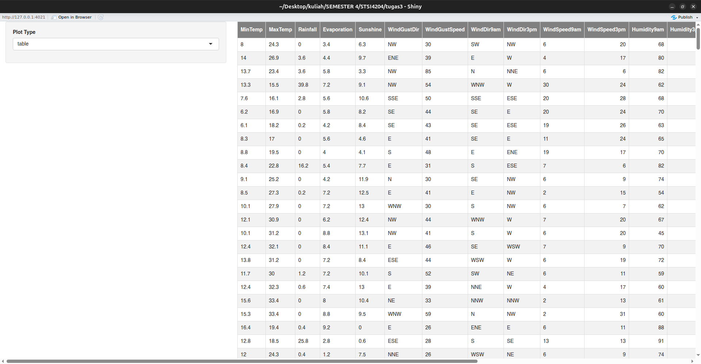
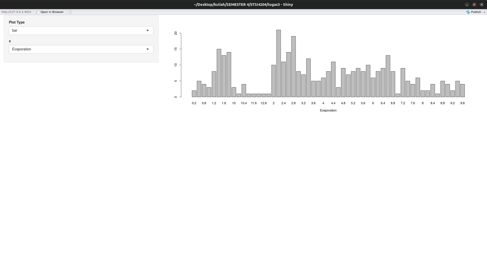
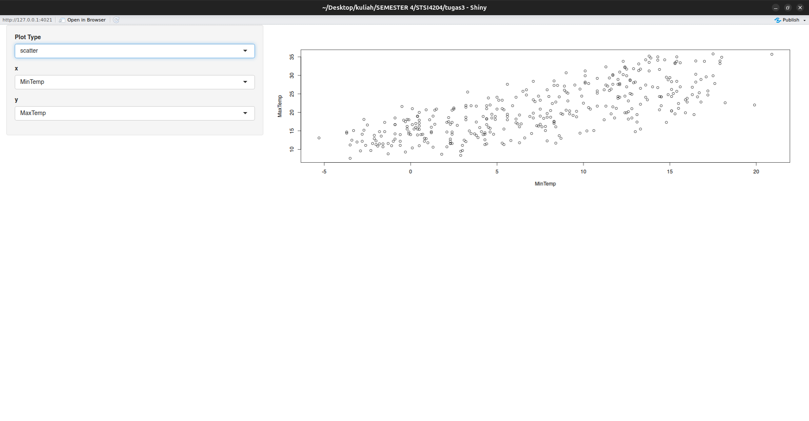
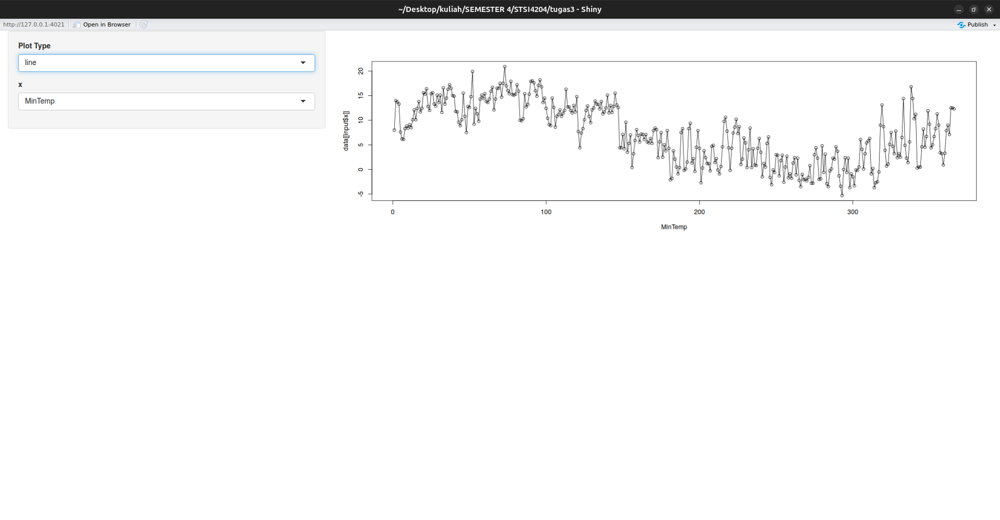

# Data Visualization In R

This project is a part of my college assignment. In this project there is a visualization of `Tugas 3 - weather.xlsx` using R programming. This project using Shiny framework to make a visualization become more interactive and customizable.

There are a few data in the data source. THe task is we should make an optional visualization for each column. This is a few capture from this project :

1. table
    

2. bar
    

3. scatter
    

4. line
    